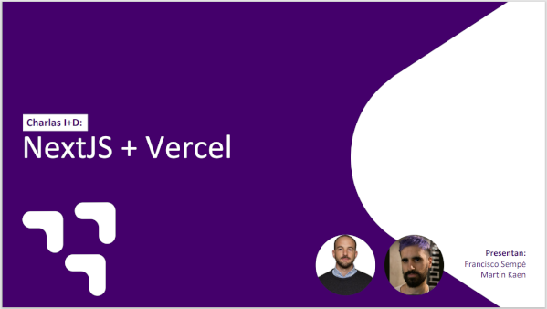

# legendary-prisma
Una vez al mes el equipo de I+D presenta una tecnología, herramientas y procesos que implementamos en el área para comunicarlos a toda la compañía. En este caso, en diciembre nos toca hablar sobre Next JS y Vercel. Vamos a mencionar características, ventajas, casos de uso y una demo que estará subida a este repo.

